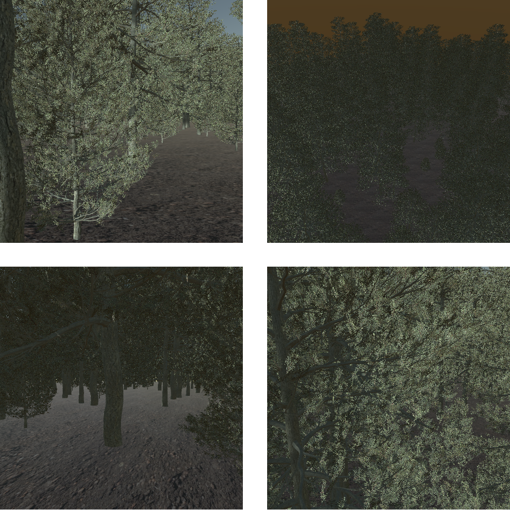
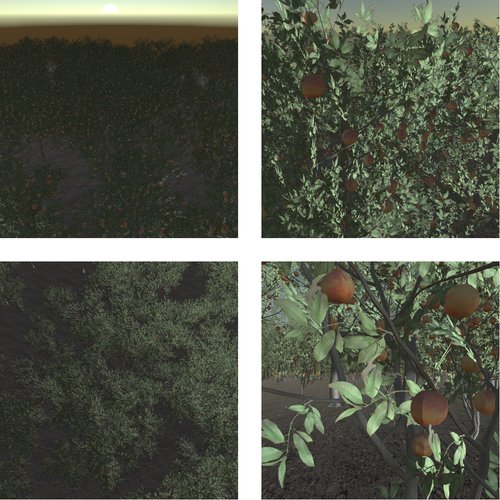
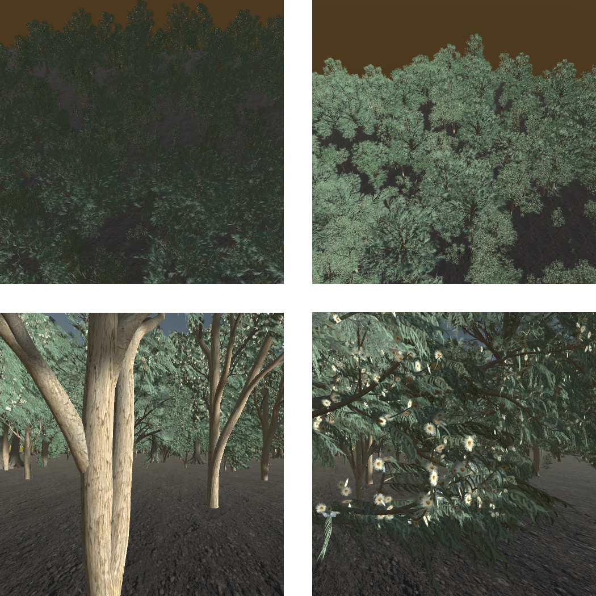
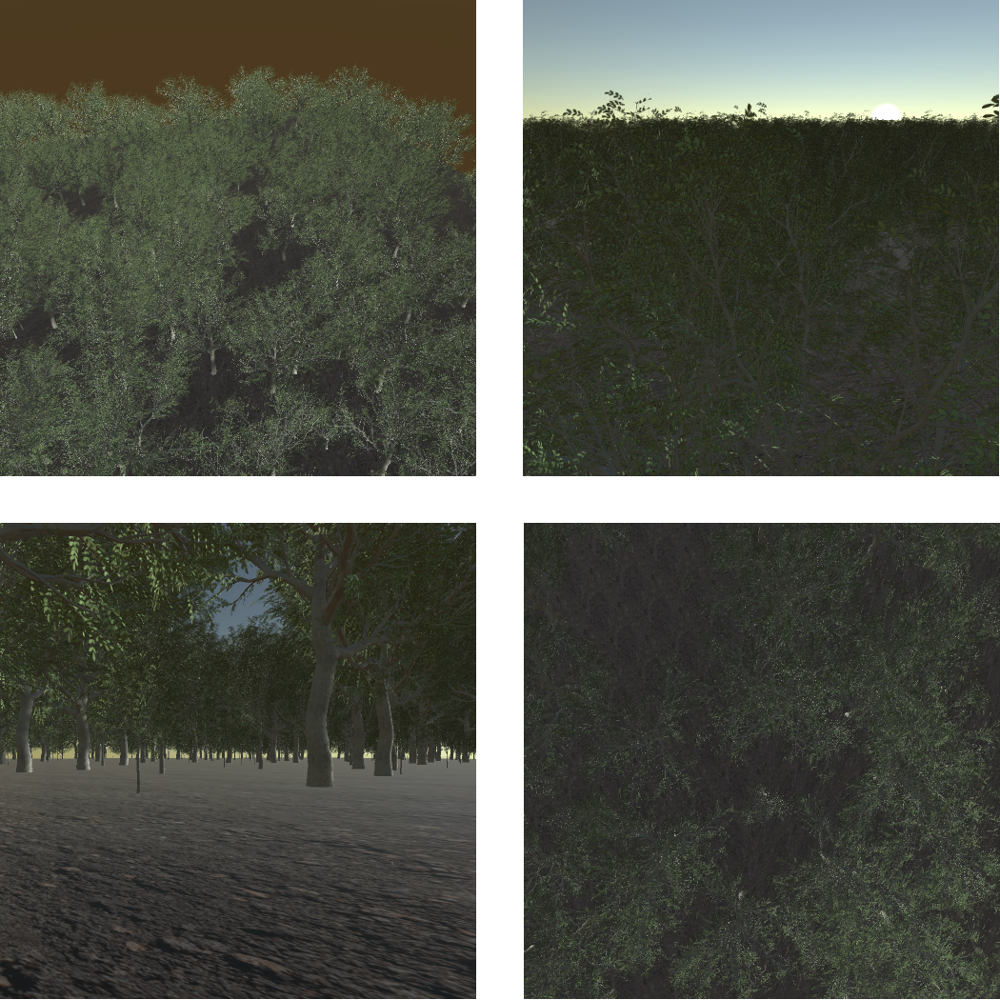
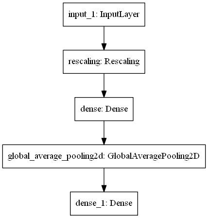
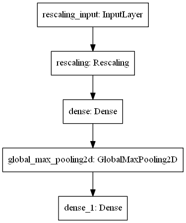
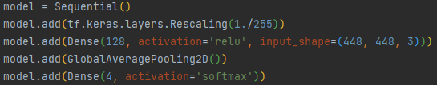
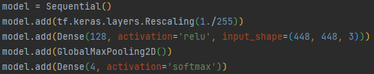

# Title

## Zbiór danych treningowych
Zbiór danych treningowych składa się z 3402 zdjęć należących do 4 klas. W procesie uczenia dzielony jest z validation split 0.2  na podzbiory train (2722 zdjęć) i test (680 zdjęć).

1. Pine - 875 zdjęć (CL13\_Pinus\_muricata\_Bishop\_Pine\_OBJ)

2. Prunus - 850 zdjęć (FR16\_Prunus\_persica\_Peach\_Tree\_OBJ-png-white)

3. Eucalyptus - 809 zdjęć (OC12\_Eucalyptus\_globulus\_Bluegum\_obj)

4.Walnut  - 868 zdjęć (JA08\_Juglans\_ailantifolia\_Japanese\_Walnut\_OBJ)

## Zbiór danych walidacyjnych 60-20-10-10
Zbiór danych walidacyjnych zawiera z 1075 zdjęć należących do 4 klas, każda z nich składa się z 3 podzbiorów.

Klasy:

1. Pine - 265 zdjęć (CL13\_Pinus\_muricata\_Bishop\_Pine\_OBJ)

2. Prunus - 269 zdjęć (FR16\_Prunus\_persica\_Peach\_Tree\_OBJ-png-white)

3. Eucalyptus - 268 zdjęć (OC12\_Eucalyptus\_globulus\_Bluegum\_obj)

4. Walnut  - 274 zdjęć (JA08\_Juglans\_ailantifolia\_Japanese\_Walnut\_OBJ)

## Perceptron - porównanie GlobalAveragePooling i GlobalMaxPooling

### Multiperceptron - architektura

    

        
    

    

        
    

### Multiperceptron - kod

    

        
    

    

        
    

