# Title

## Zbiór danych treningowych
Zbiór danych treningowych składa się z 3402 zdjęć należących do 4 klas. W procesie uczenia dzielony jest z validation split 0.2  na podzbiory train (2722 zdjęć) i test (680 zdjęć).

1. Pine - 875 zdjęć (CL13\_Pinus\_muricata\_Bishop\_Pine\_OBJ)

2. Prunus - 850 zdjęć (FR16\_Prunus\_persica\_Peach\_Tree\_OBJ-png-white)

3. Eucalyptus - 809 zdjęć (OC12\_Eucalyptus\_globulus\_Bluegum\_obj)

4.Walnut  - 868 zdjęć (JA08\_Juglans\_ailantifolia\_Japanese\_Walnut\_OBJ)

## Zbiór danych walidacyjnych 60-20-10-10
Zbiór danych walidacyjnych zawiera z 1075 zdjęć należących do 4 klas, każda z nich składa się z 3 podzbiorów.

Klasy:

1. Pine - 265 zdjęć (CL13\_Pinus\_muricata\_Bishop\_Pine\_OBJ)

2. Prunus - 269 zdjęć (FR16\_Prunus\_persica\_Peach\_Tree\_OBJ-png-white)

3. Eucalyptus - 268 zdjęć (OC12\_Eucalyptus\_globulus\_Bluegum\_obj)

4. Walnut  - 274 zdjęć (JA08\_Juglans\_ailantifolia\_Japanese\_Walnut\_OBJ)

## Perceptron - porównanie GlobalAveragePooling i GlobalMaxPooling

### Multiperceptron - architektura

### Multiperceptron - kod

### Multiperceptron - loss

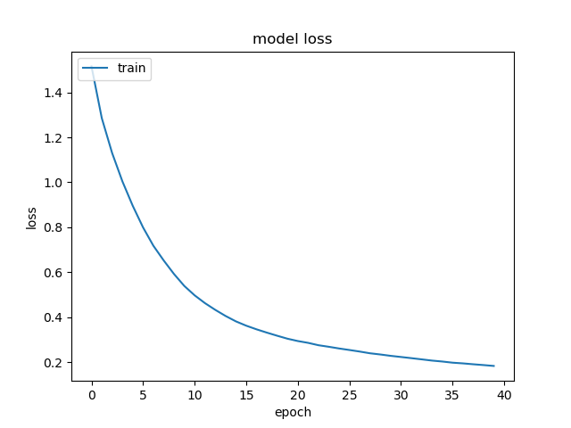

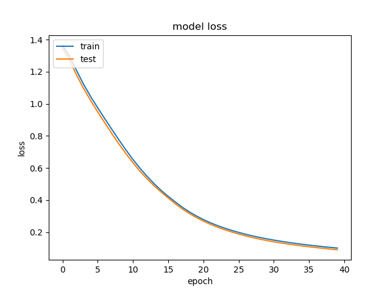

### Multiperceptron - accuracy

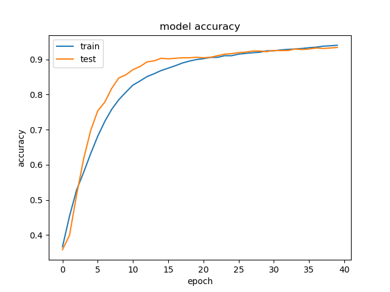

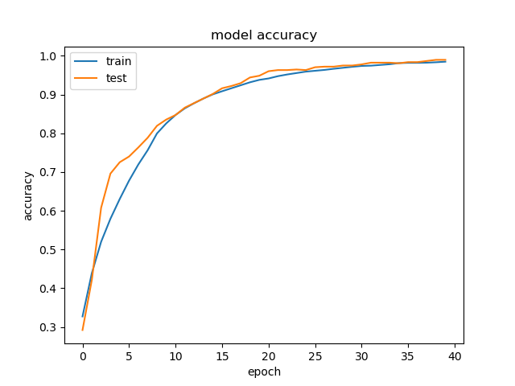

### Multiperceptron - walidacja na zbiorze 60-20-10-10

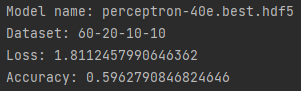

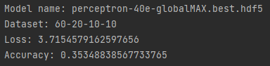

## CNN

### Podstawowy blok sieci - DephwiseConv stride (2, 2)

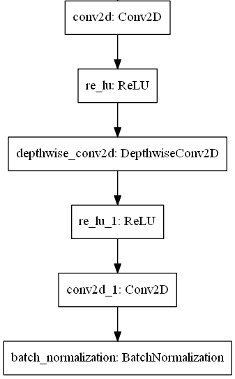

### Architektura sekwencyjna - Rescale + blok x5 + GlobalMaxPooling, Softmax

<pre>
Model: "model"
_________________________________________________________________
Layer (type)                 Output Shape              Param #   
=================================================================
input_1 (InputLayer)         [(None, 448, 448, 3)]     0         
_________________________________________________________________
rescaling (Rescaling)        (None, 448, 448, 3)       0         
_________________________________________________________________
conv2d (Conv2D)              (None, 223, 223, 32)      896       
_________________________________________________________________
re_lu (ReLU)                 (None, 223, 223, 32)      0         
_________________________________________________________________
batch_normalization (BatchNo (None, 223, 223, 32)      128       
_________________________________________________________________
dropout (Dropout)            (None, 223, 223, 32)      0         
_________________________________________________________________
conv2d_1 (Conv2D)            (None, 223, 223, 192)     6336      
_________________________________________________________________
re_lu_1 (ReLU)               (None, 223, 223, 192)     0         
_________________________________________________________________
depthwise_conv2d (DepthwiseC (None, 111, 111, 192)     1920      
_________________________________________________________________
re_lu_2 (ReLU)               (None, 111, 111, 192)     0         
_________________________________________________________________
conv2d_2 (Conv2D)            (None, 111, 111, 48)      9264      
_________________________________________________________________
batch_normalization_1 (Batch (None, 111, 111, 48)      192       
_________________________________________________________________
dropout_1 (Dropout)          (None, 111, 111, 48)      0         
_________________________________________________________________
conv2d_3 (Conv2D)            (None, 111, 111, 240)     11760     
_________________________________________________________________
re_lu_3 (ReLU)               (None, 111, 111, 240)     0         
_________________________________________________________________
depthwise_conv2d_1 (Depthwis (None, 55, 55, 240)       2400      
_________________________________________________________________
re_lu_4 (ReLU)               (None, 55, 55, 240)       0         
_________________________________________________________________
conv2d_4 (Conv2D)            (None, 55, 55, 64)        15424     
_________________________________________________________________
batch_normalization_2 (Batch (None, 55, 55, 64)        256       
_________________________________________________________________
dropout_2 (Dropout)          (None, 55, 55, 64)        0         
_________________________________________________________________
conv2d_5 (Conv2D)            (None, 55, 55, 540)       35100     
_________________________________________________________________
re_lu_5 (ReLU)               (None, 55, 55, 540)       0         
_________________________________________________________________
depthwise_conv2d_2 (Depthwis (None, 27, 27, 540)       5400      
_________________________________________________________________
re_lu_6 (ReLU)               (None, 27, 27, 540)       0         
_________________________________________________________________
conv2d_7 (Conv2D)            (None, 27, 27, 960)       519360    
_________________________________________________________________
re_lu_7 (ReLU)               (None, 27, 27, 960)       0         
_________________________________________________________________
depthwise_conv2d_3 (Depthwis (None, 13, 13, 960)       9600      
_________________________________________________________________
re_lu_8 (ReLU)               (None, 13, 13, 960)       0         
_________________________________________________________________
conv2d_8 (Conv2D)            (None, 13, 13, 196)       188356    
_________________________________________________________________
batch_normalization_4 (Batch (None, 13, 13, 196)       784       
_________________________________________________________________
dropout_4 (Dropout)          (None, 13, 13, 196)       0         
_________________________________________________________________
conv2d_9 (Conv2D)            (None, 13, 13, 1440)      283680    
_________________________________________________________________
re_lu_9 (ReLU)               (None, 13, 13, 1440)      0         
_________________________________________________________________
depthwise_conv2d_4 (Depthwis (None, 6, 6, 1440)        14400     
_________________________________________________________________
re_lu_10 (ReLU)              (None, 6, 6, 1440)        0         
_________________________________________________________________
conv2d_10 (Conv2D)           (None, 6, 6, 360)         518760    
_________________________________________________________________
global_max_pooling2d (Global (None, 360)               0         
_________________________________________________________________
dense (Dense)                (None, 4)                 1444      
=================================================================
Total params: 1,625,460
Trainable params: 1,624,780
Non-trainable params: 680
_________________________________________________________________
</pre>

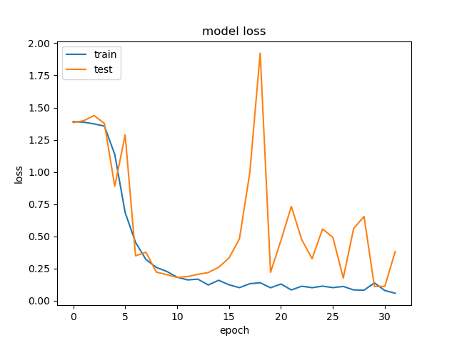

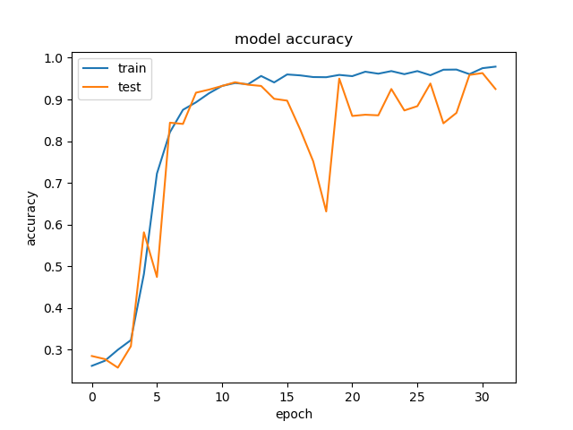

### Architektura z dodtkowymi połączeniami między blokami

<pre>
Model: "model"
__________________________________________________________________________________________________
Layer (type)                    Output Shape         Param #     Connected to                     
==================================================================================================
input_1 (InputLayer)            [(None, 448, 448, 3) 0                                            
__________________________________________________________________________________________________
rescaling (Rescaling)           (None, 448, 448, 3)  0           input_1[0][0]                    
__________________________________________________________________________________________________
conv2d (Conv2D)                 (None, 223, 223, 32) 896         rescaling[0][0]                  
__________________________________________________________________________________________________
re_lu (ReLU)                    (None, 223, 223, 32) 0           conv2d[0][0]                     
__________________________________________________________________________________________________
batch_normalization (BatchNorma (None, 223, 223, 32) 128         re_lu[0][0]                      
__________________________________________________________________________________________________
conv2d_1 (Conv2D)               (None, 223, 223, 192 6336        batch_normalization[0][0]        
__________________________________________________________________________________________________
re_lu_1 (ReLU)                  (None, 223, 223, 192 0           conv2d_1[0][0]                   
__________________________________________________________________________________________________
depthwise_conv2d (DepthwiseConv (None, 111, 111, 192 1920        re_lu_1[0][0]                    
__________________________________________________________________________________________________
re_lu_2 (ReLU)                  (None, 111, 111, 192 0           depthwise_conv2d[0][0]           
__________________________________________________________________________________________________
conv2d_2 (Conv2D)               (None, 111, 111, 48) 9264        re_lu_2[0][0]                    
__________________________________________________________________________________________________
batch_normalization_1 (BatchNor (None, 111, 111, 48) 192         conv2d_2[0][0]                   
__________________________________________________________________________________________________
average_pooling2d (AveragePooli (None, 111, 111, 32) 0           batch_normalization[0][0]        
__________________________________________________________________________________________________
concatenate (Concatenate)       (None, 111, 111, 80) 0           batch_normalization_1[0][0]      
                                                                 average_pooling2d[0][0]          
__________________________________________________________________________________________________
batch_normalization_2 (BatchNor (None, 111, 111, 80) 320         concatenate[0][0]                
__________________________________________________________________________________________________
re_lu_3 (ReLU)                  (None, 111, 111, 80) 0           batch_normalization_2[0][0]      
__________________________________________________________________________________________________
conv2d_3 (Conv2D)               (None, 111, 111, 40) 3240        re_lu_3[0][0]                    
__________________________________________________________________________________________________
conv2d_4 (Conv2D)               (None, 111, 111, 240 9840        conv2d_3[0][0]                   
__________________________________________________________________________________________________
re_lu_4 (ReLU)                  (None, 111, 111, 240 0           conv2d_4[0][0]                   
__________________________________________________________________________________________________
depthwise_conv2d_1 (DepthwiseCo (None, 55, 55, 240)  2400        re_lu_4[0][0]                    
__________________________________________________________________________________________________
re_lu_5 (ReLU)                  (None, 55, 55, 240)  0           depthwise_conv2d_1[0][0]         
__________________________________________________________________________________________________
conv2d_5 (Conv2D)               (None, 55, 55, 64)   15424       re_lu_5[0][0]                    
__________________________________________________________________________________________________
batch_normalization_3 (BatchNor (None, 55, 55, 64)   256         conv2d_5[0][0]                   
__________________________________________________________________________________________________
average_pooling2d_2 (AveragePoo (None, 55, 55, 48)   0           batch_normalization_1[0][0]      
__________________________________________________________________________________________________
average_pooling2d_1 (AveragePoo (None, 55, 55, 32)   0           batch_normalization[0][0]        
__________________________________________________________________________________________________
concatenate_1 (Concatenate)     (None, 55, 55, 144)  0           batch_normalization_3[0][0]      
                                                                 average_pooling2d_2[0][0]        
                                                                 average_pooling2d_1[0][0]        
__________________________________________________________________________________________________
batch_normalization_4 (BatchNor (None, 55, 55, 144)  576         concatenate_1[0][0]              
__________________________________________________________________________________________________
re_lu_6 (ReLU)                  (None, 55, 55, 144)  0           batch_normalization_4[0][0]      
__________________________________________________________________________________________________
conv2d_6 (Conv2D)               (None, 55, 55, 90)   13050       re_lu_6[0][0]                    
__________________________________________________________________________________________________
conv2d_7 (Conv2D)               (None, 55, 55, 540)  49140       conv2d_6[0][0]                   
__________________________________________________________________________________________________
re_lu_7 (ReLU)                  (None, 55, 55, 540)  0           conv2d_7[0][0]                   
__________________________________________________________________________________________________
depthwise_conv2d_2 (DepthwiseCo (None, 27, 27, 540)  5400        re_lu_7[0][0]                    
__________________________________________________________________________________________________
re_lu_8 (ReLU)                  (None, 27, 27, 540)  0           depthwise_conv2d_2[0][0]         
__________________________________________________________________________________________________
conv2d_8 (Conv2D)               (None, 27, 27, 128)  69248       re_lu_8[0][0]                    
__________________________________________________________________________________________________
batch_normalization_5 (BatchNor (None, 27, 27, 128)  512         conv2d_8[0][0]                   
__________________________________________________________________________________________________
average_pooling2d_5 (AveragePoo (None, 27, 27, 64)   0           batch_normalization_3[0][0]      
__________________________________________________________________________________________________
average_pooling2d_4 (AveragePoo (None, 27, 27, 48)   0           batch_normalization_1[0][0]      
__________________________________________________________________________________________________
average_pooling2d_3 (AveragePoo (None, 27, 27, 32)   0           batch_normalization[0][0]        
__________________________________________________________________________________________________
concatenate_2 (Concatenate)     (None, 27, 27, 272)  0           batch_normalization_5[0][0]      
                                                                 average_pooling2d_5[0][0]        
                                                                 average_pooling2d_4[0][0]        
                                                                 average_pooling2d_3[0][0]        
__________________________________________________________________________________________________
batch_normalization_6 (BatchNor (None, 27, 27, 272)  1088        concatenate_2[0][0]              
__________________________________________________________________________________________________
re_lu_9 (ReLU)                  (None, 27, 27, 272)  0           batch_normalization_6[0][0]      
__________________________________________________________________________________________________
conv2d_9 (Conv2D)               (None, 27, 27, 160)  43680       re_lu_9[0][0]                    
__________________________________________________________________________________________________
conv2d_10 (Conv2D)              (None, 27, 27, 960)  154560      conv2d_9[0][0]                   
__________________________________________________________________________________________________
re_lu_10 (ReLU)                 (None, 27, 27, 960)  0           conv2d_10[0][0]                  
__________________________________________________________________________________________________
depthwise_conv2d_3 (DepthwiseCo (None, 13, 13, 960)  9600        re_lu_10[0][0]                   
__________________________________________________________________________________________________
re_lu_11 (ReLU)                 (None, 13, 13, 960)  0           depthwise_conv2d_3[0][0]         
__________________________________________________________________________________________________
conv2d_11 (Conv2D)              (None, 13, 13, 196)  188356      re_lu_11[0][0]                   
__________________________________________________________________________________________________
batch_normalization_7 (BatchNor (None, 13, 13, 196)  784         conv2d_11[0][0]                  
__________________________________________________________________________________________________
average_pooling2d_9 (AveragePoo (None, 13, 13, 128)  0           batch_normalization_5[0][0]      
__________________________________________________________________________________________________
average_pooling2d_8 (AveragePoo (None, 13, 13, 64)   0           batch_normalization_3[0][0]      
__________________________________________________________________________________________________
average_pooling2d_7 (AveragePoo (None, 13, 13, 48)   0           batch_normalization_1[0][0]      
__________________________________________________________________________________________________
average_pooling2d_6 (AveragePoo (None, 13, 13, 32)   0           batch_normalization[0][0]        
__________________________________________________________________________________________________
concatenate_3 (Concatenate)     (None, 13, 13, 468)  0           batch_normalization_7[0][0]      
                                                                 average_pooling2d_9[0][0]        
                                                                 average_pooling2d_8[0][0]        
                                                                 average_pooling2d_7[0][0]        
                                                                 average_pooling2d_6[0][0]        
__________________________________________________________________________________________________
batch_normalization_8 (BatchNor (None, 13, 13, 468)  1872        concatenate_3[0][0]              
__________________________________________________________________________________________________
re_lu_12 (ReLU)                 (None, 13, 13, 468)  0           batch_normalization_8[0][0]      
__________________________________________________________________________________________________
conv2d_12 (Conv2D)              (None, 13, 13, 240)  112560      re_lu_12[0][0]                   
__________________________________________________________________________________________________
conv2d_13 (Conv2D)              (None, 13, 13, 1440) 347040      conv2d_12[0][0]                  
__________________________________________________________________________________________________
re_lu_13 (ReLU)                 (None, 13, 13, 1440) 0           conv2d_13[0][0]                  
__________________________________________________________________________________________________
depthwise_conv2d_4 (DepthwiseCo (None, 6, 6, 1440)   14400       re_lu_13[0][0]                   
__________________________________________________________________________________________________
re_lu_14 (ReLU)                 (None, 6, 6, 1440)   0           depthwise_conv2d_4[0][0]         
__________________________________________________________________________________________________
conv2d_14 (Conv2D)              (None, 6, 6, 360)    518760      re_lu_14[0][0]                   
__________________________________________________________________________________________________
global_max_pooling2d (GlobalMax (None, 360)          0           conv2d_14[0][0]                  
__________________________________________________________________________________________________
dense (Dense)                   (None, 4)            1444        global_max_pooling2d[0][0]       
==================================================================================================
Total params: 1,582,286
Trainable params: 1,579,422
Non-trainable params: 2,864
__________________________________________________________________________________________________
</pre>

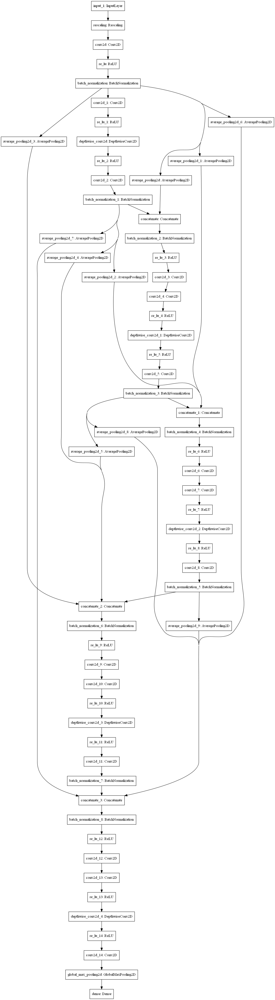

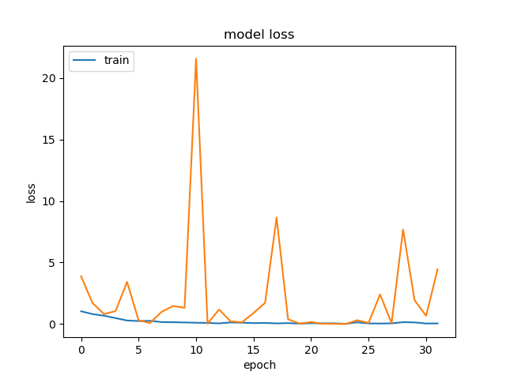

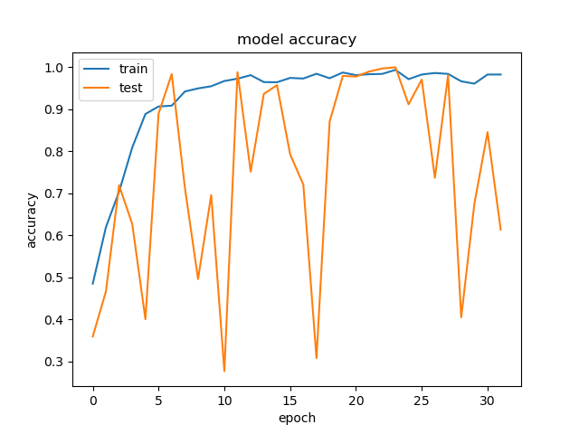

### CNN - walidacja na zbiorze 60-20-10-10

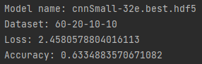

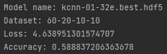

## CNN - wizualizacja kerneli konwolucji w pierwszej warstwie

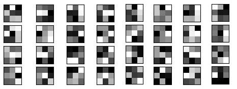

## CNN - mapy cech wyjść poszczególnych bloków

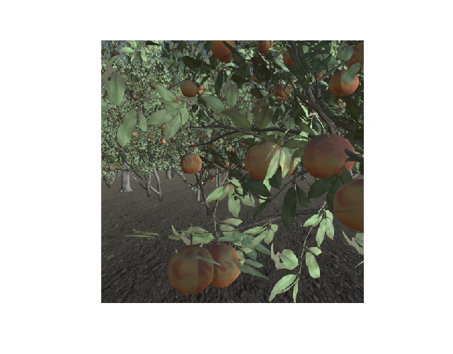

Zbiór: treningowy

Klasa: Prunus

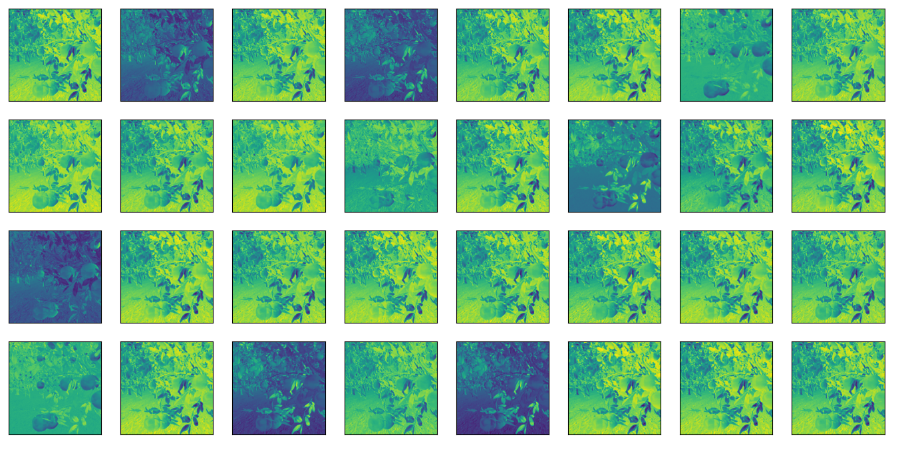

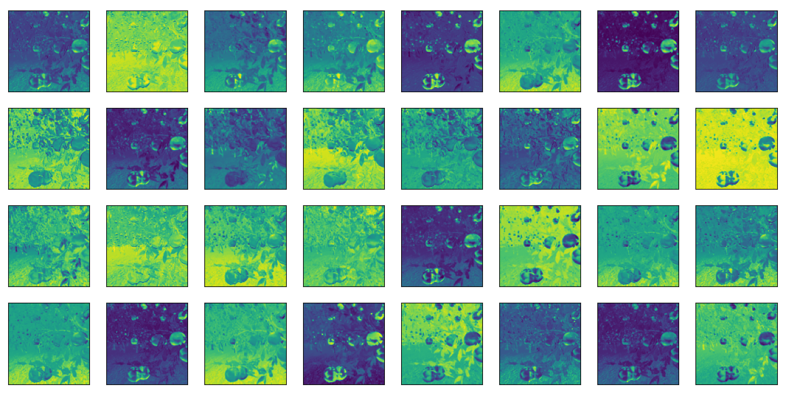

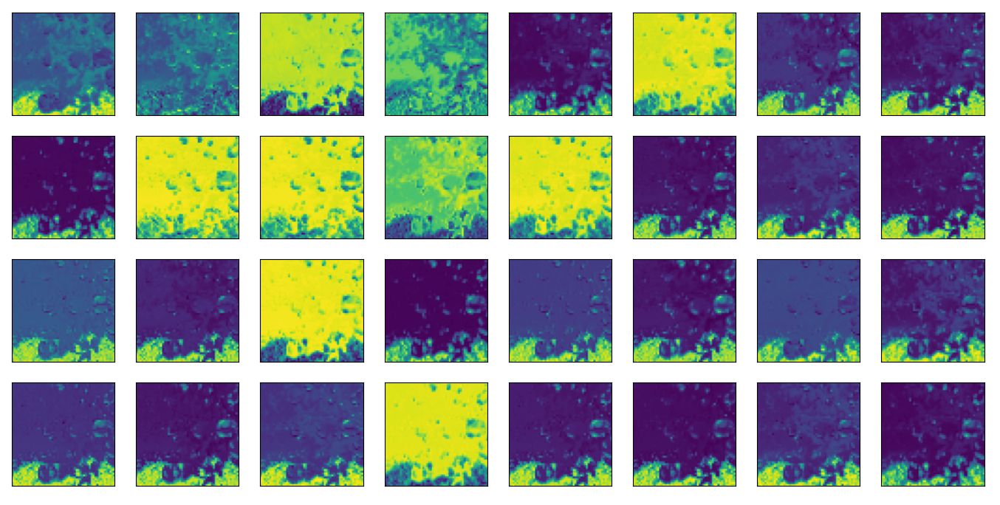

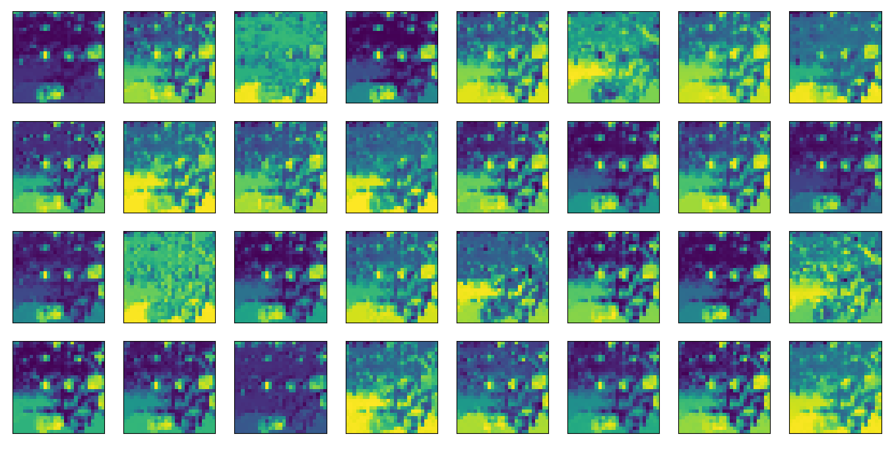

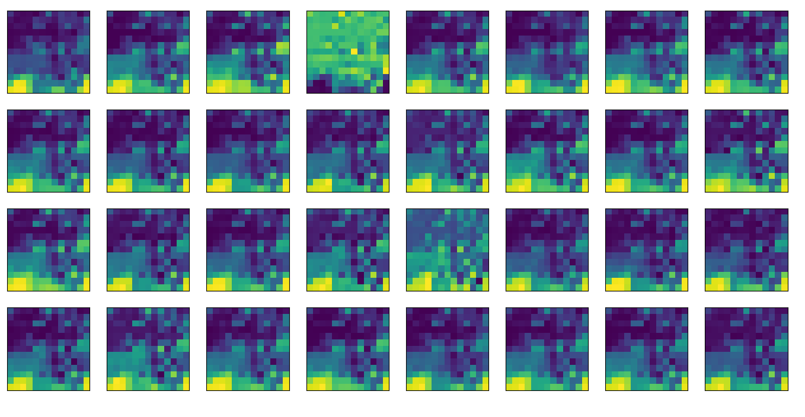

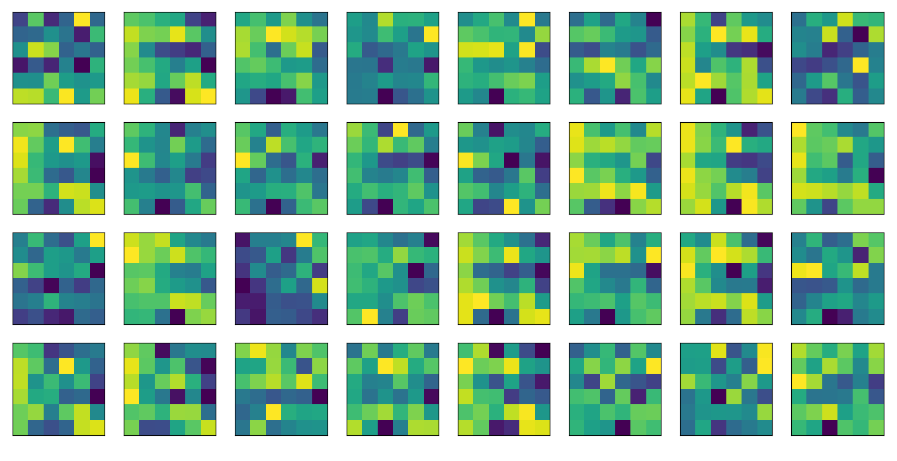

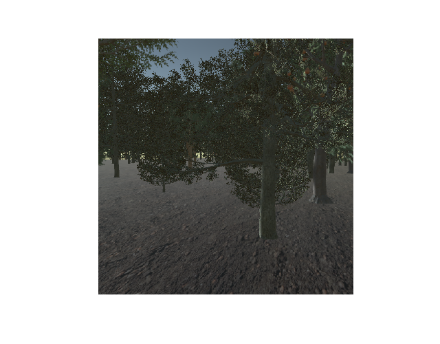

Zbiór: walidacyjny

Klasa: Prunus

Podzbiór: Pine 10%, Prunus 60%, Walnut 10%, Eucalyptus 20%

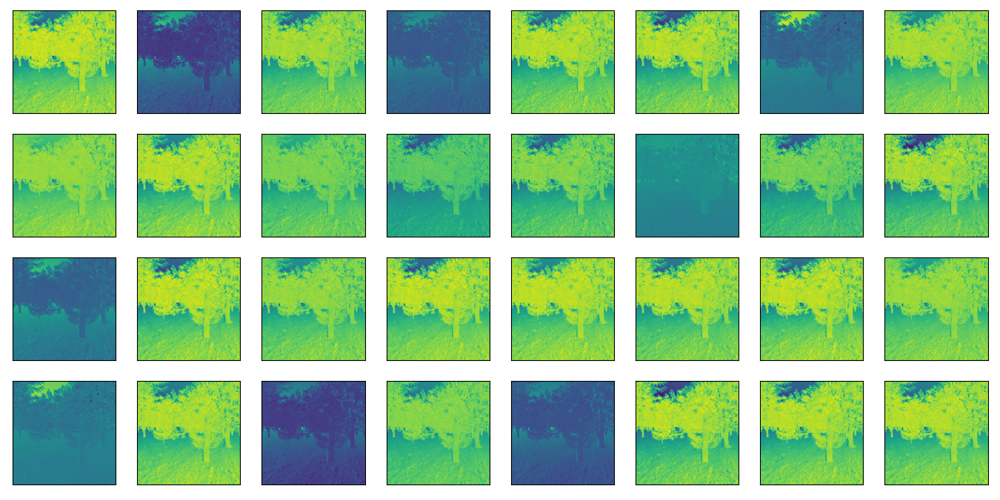

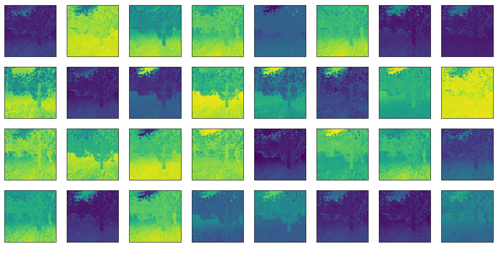

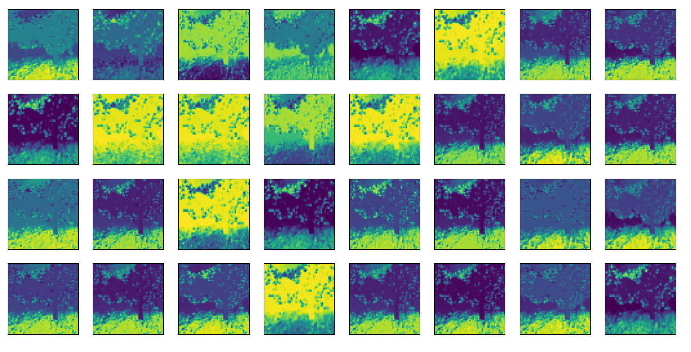

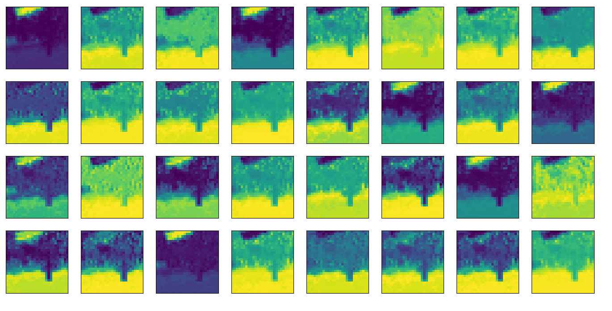

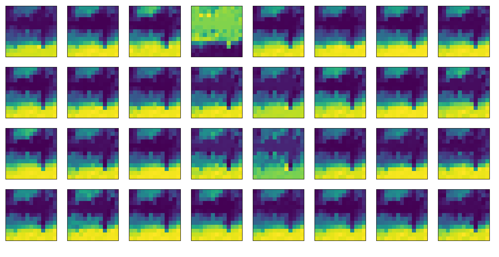

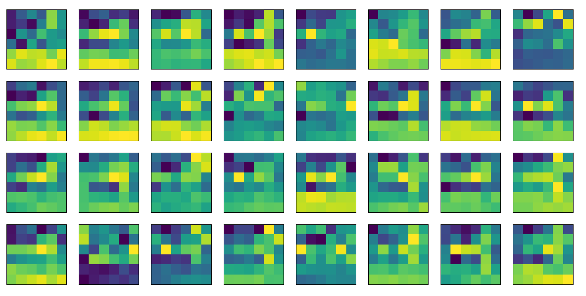

## CNN - Explainer

Zbiór: treningowy

Klasa: Prunus

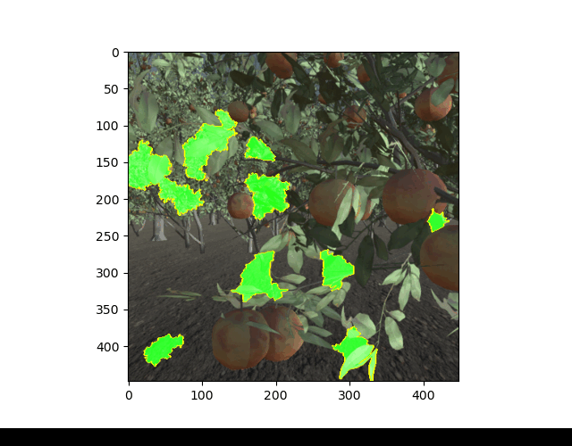

Zbiór: walidacyjny

Klasa: Pine

Podzbiór: Pine 60%, Prunus 10%, Walnut 10%, Eucalyptus 20%

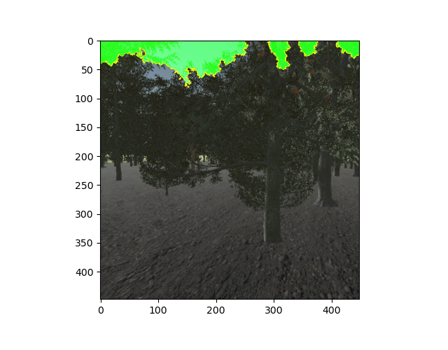

Zbiór: walidacyjny

Klasa: Prunus

Podzbiór: Pine 10%, Prunus 60%, Walnut 10%, Eucalyptus 20%

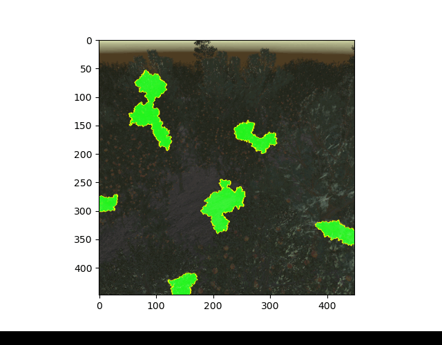

